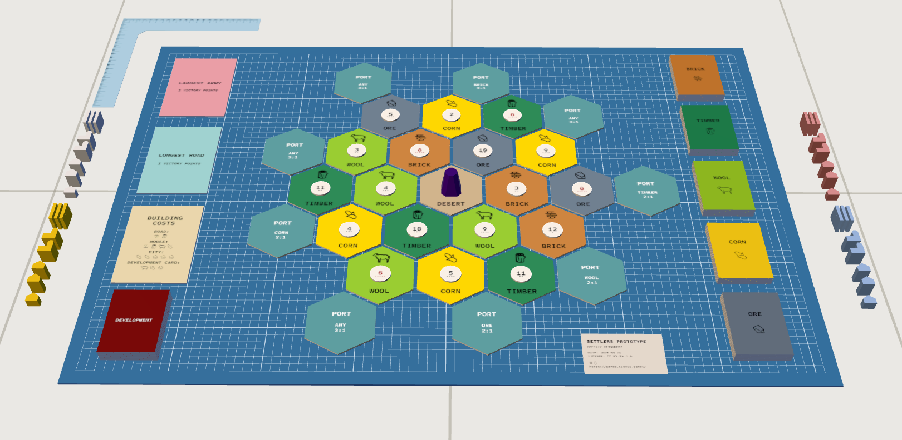

# Settlers

This repository generates SVG images for a board game similar to [Settlers of Catan](https://www.catan.com/), by Klaus Teuber. It can be imported directly into Probability.

[](https://neftalydotcom.prob.nz/title/settlers)
[Play Settlers on Probability](https://neftalydotcom.prob.nz/title/settlers)

To change the setup, edit the `src/data/components.csv` spreadsheet and run:

```sh
# requires node.js (https://nodejs.org/)
npm install
npm run build
```

## Notes

The SVG use real dimensions (mm not px), so the import tool can auto-size.
Hex and round tiles use a shape on a transparent bg, so they are auto-cut.
