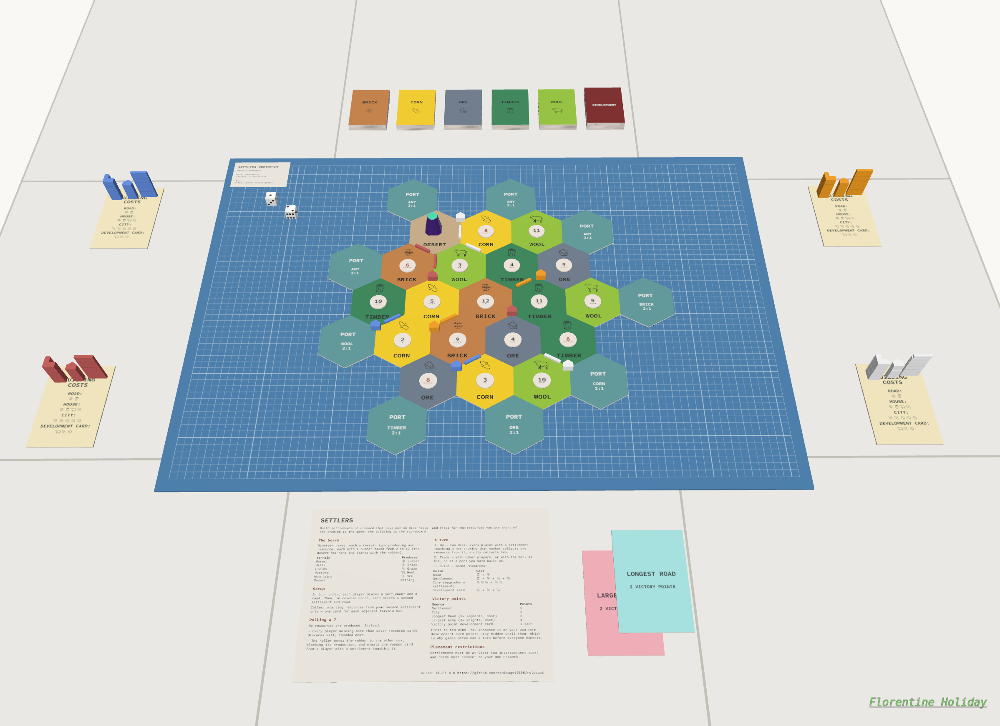
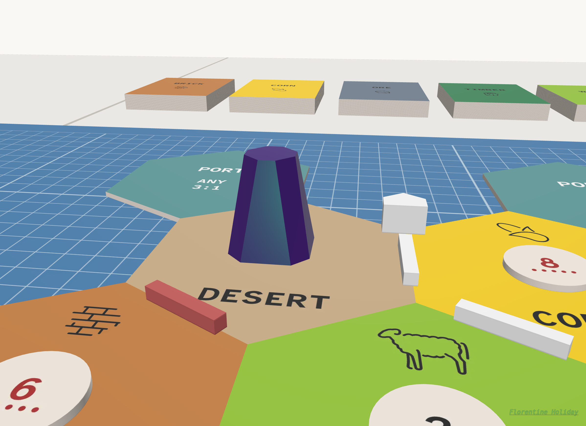

# Settlers

This repository generates SVG images and includes a 3D robber for a board game similar to [Settlers of Catan](https://www.catan.com/), by Klaus Teuber. It can be imported directly into Probability.

[](https://neftalydotcom.prob.nz/title/settlers)
[](https://neftalydotcom.prob.nz/title/settlers)
[Play Settlers on Probability](https://neftalydotcom.prob.nz/title/settlers)

To change the setup, edit the `src/data/components.csv` spreadsheet and run:

```sh
# requires node.js (https://nodejs.org/)
npm install
npm run build
```

## Saved game

[Download the complete Probability game](dist/settlers.zip). The archive includes the saved layout, all models and textures, landscape building-cost cards, and the 40 × 40 cm [private play mat](private-play-area_4mm_001.svg). The mat SVG includes its font and emoji attribution.

Terrain, number tokens, and ports follow the beginner setup on page 3 of the [Catan rules](https://www.catan.com/sites/default/files/2021-06/catan_base_rules_2020_200707.pdf). Hex tiles retain a 1 mm gap. Other positions are rounded to millimetres, and every colour uses the same piece-stack positions and rotations.

The ZIP is a snapshot exported from the live game; `npm run build` regenerates the SVG artwork, not the saved game layout. After updating the live game, use its **Create → Save** action to replace `dist/settlers.zip`.

## Notes

The SVG use real dimensions (mm not px), so the import tool can auto-size.
Hex and round tiles use a shape on a transparent bg, so they are auto-cut.

The [robber glTF](dist/svg/robber/robber.gltf) is generated from the React Three Fiber component in `src/assets/robber.jsx` on every build. It preserves the original 30 mm chamfered obelisk, purple plastic, green specular sheen, iridescence and clearcoat. Mesh data is stored in `robber.bin`; keep it beside `robber.gltf` when importing. JSON is minified. Meshopt was measured at 3,064 bytes total versus 2,956 bytes without compression, so this small model uses the smaller uncompressed buffer. There are no image textures. Identical vertices are indexed in one mesh. The redundant foot cap is removed; the body retains its bottom face.

Both robber alternatives are exported to `dist/svg/robber/`: the original triangular `robber_25mm_001.svg` and the 3D `robber.gltf`. Choose either format when importing.
