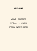
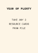
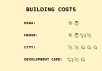
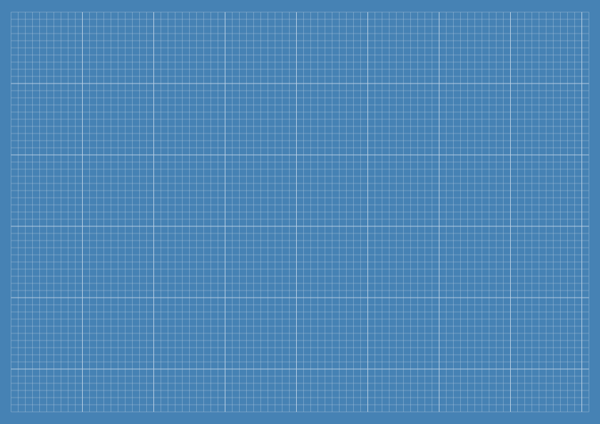
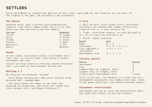

# SVG list

## awards/largest-army

## awards/longest-road

## bank/brick

## bank/corn

## bank/development

## bank/ore

## bank/timber

## bank/wool

## numbers

## players/blue

## players/blue/cities

## players/blue/houses

## players/blue/roads

## players/orange

## players/orange/cities

## players/orange/houses

## players/orange/roads

## players/red

## players/red/cities

## players/red/houses

## players/red/roads

## players/white

## players/white/cities

## players/white/houses

## players/white/roads

## playmat/business-card

## playmat

## ports

## robber

## rules

## terrain/brick

## terrain/corn

## terrain/desert

## terrain/ore

## terrain/timber

## terrain/wool

